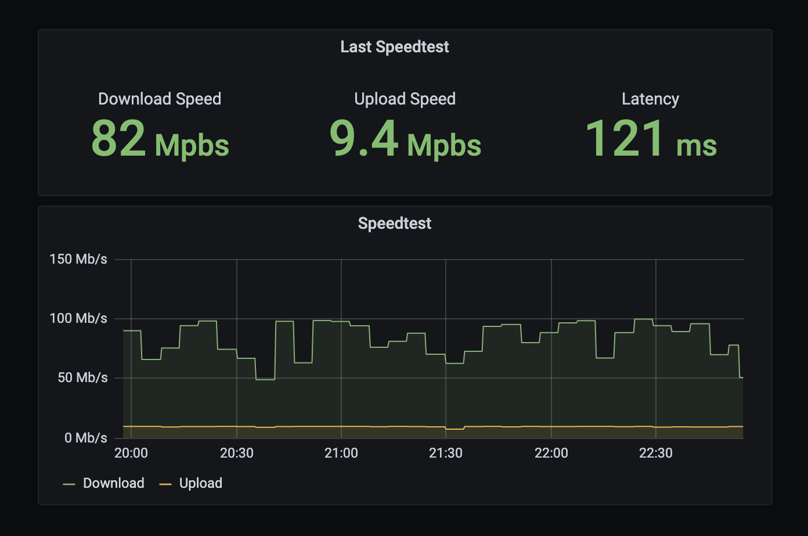

# speedtest2influx

Runs a [Speedtest](https://www.speedtest.net/) and logs the results to [InfluxDB](https://www.influxdata.com/).



Written in go. ARM friendly docker images. Helm for easy k8s deployments.

## Usage
```
Usage:
  speedtest2influx [OPTIONS]

Application Options:
      --interval=         how often in seconds to run a speedtest and track the
                          results. If a interval is not provided, this will
                          track once then exit
      --influxdb-url=     URL to influxdb server
      --influxdb-token=   API token for influxdb server
      --influxdb-org=     influxdb org to write to
      --influxdb-bucket=  influxdb bucket to write to
      --speedtest-server= speedtest server id, if none is provided the nearest
                          server will be used

Help Options:
  -h, --help              Show this help message
```

### influxdb
#### Measurement
* **`speedtest`** - All data collected will be under a speedtest measurement

#### Fields
* **`download`** - Download speed in Mbps
* **`upload`** - Upload speed in Mbps
* **`latency`** - Server latency speed in ms
* **`distance`** - Distance to speedtest server

#### Tags
* **`id`** - Speedtest server id
* **`country`** - Country of speedtest server
* **`name`** - Name of speedtest server

### Docker
```
docker run adamthesax/speedtest2influx --help
```

### Helm
```
helm repo add speedtest2influx https://adamthesax.github.io/speedtest2influx
helm install \
    --set influxdb.url="http://influxdb.datastore.svc.cluster.local:8086" \
    --set influxdb.org=myorg \
    --set influxdb.bucket=speedtest \
    speedtest2influx speedtest2influx/speedtest2influx
```

### Helm Values
| name                 | description                                 | required | default |
|----------------------|---------------------------------------------|----------|---------|
| `speedtest.interval` | How often to run the speedtest (seconds)    | true     | `300`   |
| `speedtest.server`   | ID of speedtest server. Defaults to fastest | false    |         |
| `influxdb.url`       | HTTP(S) url to influxdb server.             | true     |         |
| `influxdb.token`     | HTTP(S) url to influxdb server.             | false    |         |
| `influxdb.org`       | InfluxDB org to write report to.            | true     |         |
| `influxdb.bucket`    | InfluxDB bucket to write report to.         | true     |         |

